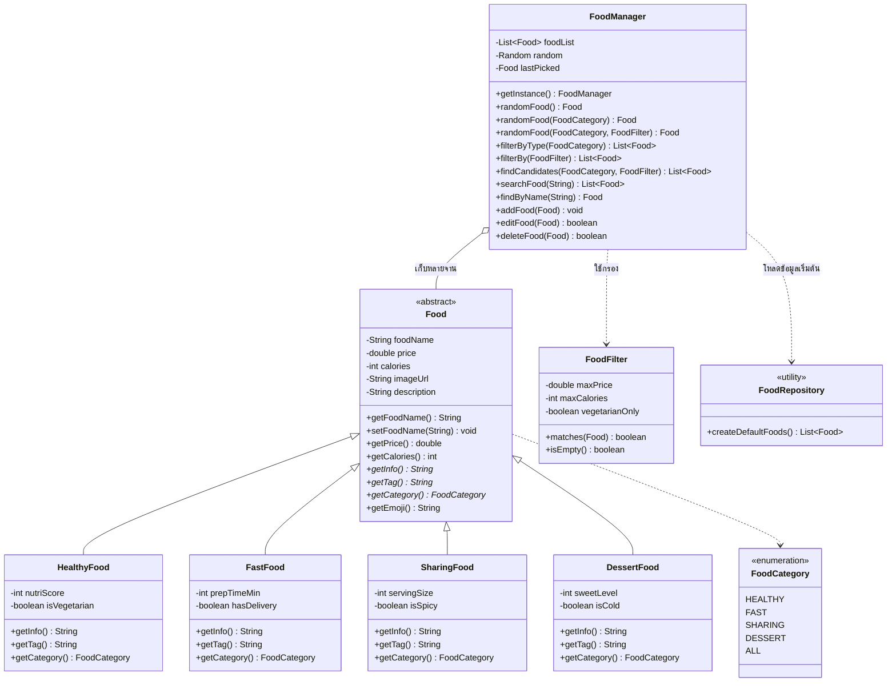
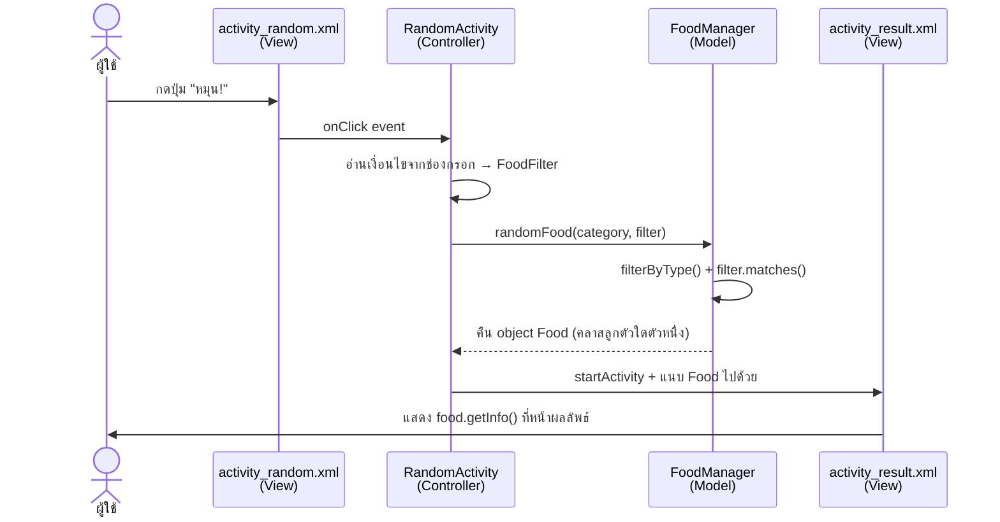
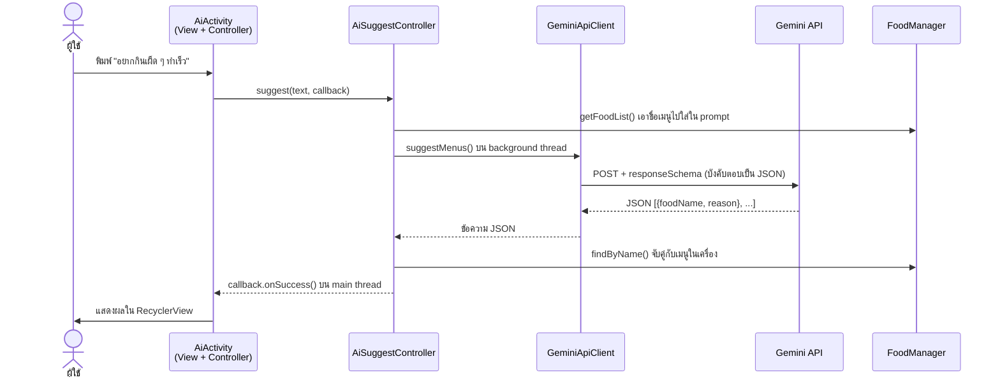

# สถาปัตยกรรมของแอป Gin Rai Dee?

เอกสารนี้อธิบายว่าโค้ดถูกจัดวางตามหลัก **OOP + MVC** อย่างไร
เอาไปใช้ประกอบรายงานและสไลด์นำเสนอได้เลย

---

## 1. Class Diagram

### ทำไมต้องแยก `FoodManager` ออกจาก `Food`

`Food` มีหน้าที่เดียวคือ **เก็บข้อมูลอาหาร 1 จาน**
ส่วนการสุ่ม / ค้นหา / กรอง เป็นงานของ **คลังเมนูทั้งกอง** ไม่ใช่ของอาหารจานเดียว

ถ้าเอา `randomFood()` ไปไว้ในคลาส `Food` จะกลายเป็นว่า "ผัดกะเพรา 1 จาน สุ่มตัวเองได้"
ซึ่งไม่สมเหตุสมผล และผิดหลัก **Single Responsibility**

---

## 2. โครงสร้าง MVC

| ชั้น | หน้าที่ | ไฟล์ |
|---|---|---|
| **Model** | เก็บข้อมูล + กฎการทำงาน ไม่รู้จักหน้าจอเลย | `model/*.java` |
| **View** | หน้าตาอย่างเดียว ไม่มี logic | `res/layout/*.xml` |
| **Controller** | รับ event จากผู้ใช้ เชื่อม Model กับ View | `controller/*.java` |

**กฎที่ยึดตลอดทั้งโปรเจค**

- ไฟล์ใน `model/` **ห้าม import อะไรที่ขึ้นต้นด้วย `android.` หรือ `androidx.`**
  (เพราะงั้นถึงเอาไปเทสต์บน JVM ธรรมดาได้)
- ไฟล์ XML ใน `res/layout/` ไม่มีโค้ดคำนวณอะไรเลย
- Activity ไม่คำนวณเอง ต้องถาม `FoodManager` เสมอ

---

## 3. Flow ตอนกดปุ่ม "หมุน"

จุดที่ **Polymorphism** ทำงาน คือบรรทัดสุดท้าย —
`ResultActivity` เรียก `food.getInfo()` เหมือนกันทุกครั้ง
แต่ข้อความที่ออกมาต่างกัน เพราะ object จริง ๆ เป็นคนละคลาสลูก
และ Activity **ไม่ต้องเขียน `if` เช็คว่าเป็นคลาสอะไรเลยสักตัว**

---

## 4. Flow ของหน้า "แนะนำโดย AI"

### ประเด็นสำคัญ 3 ข้อ

1. **API key ไม่ได้อยู่ในโค้ด** — อ่านจาก `local.properties` เข้ามาเป็น `BuildConfig.GEMINI_API_KEY`
   ตอน build ไฟล์ `local.properties` ถูก gitignore ไว้ คีย์เลยไม่หลุดขึ้น GitHub
2. **ยิงเน็ตบน background thread เสมอ** — ถ้ายิงบน main thread แอปจะ crash
   ด้วย `NetworkOnMainThreadException` ตรงนี้ `AiSuggestController` จัดการให้ด้วย `ExecutorService`
   แล้วส่งผลกลับ main thread ผ่าน `Handler`
3. **บังคับให้ AI ตอบเป็น JSON** ด้วย `responseMimeType` + `responseSchema`
   จะได้ `parse` เข้า object ตรง ๆ ไม่ต้องมานั่งตัดข้อความเอาเอง

---

## 5. สิ่งที่ปรับจาก PROJECT_CONTEXT.md เดิม

| เรื่อง | ที่วางไว้เดิม | ที่ทำจริง | เหตุผล |
|---|---|---|---|
| รูปอาหาร | `imageUrl : String` | เก็บ field ไว้เหมือนเดิม แต่ยังไม่ได้ใช้ ตอนนี้แสดงเป็นอีโมจิผ่าน `getEmoji()` | แอปทำงาน offline การโหลดรูปจาก URL ต้องต่อเน็ต ขัดกับ scope — ถ้าจะใส่รูปจริงให้ใส่เป็น drawable ในเครื่องแทน |
| หมวดอาหาร | ไม่ได้ระบุ | เพิ่ม enum `FoodCategory` | กันพิมพ์ชื่อหมวดผิด และผูกปุ่มใน Choice Page เข้ากับคลาสลูกได้ตรงตัว |
| Filter | เขียนไว้ว่า "Filter ตามเงื่อนไข" ลอย ๆ | เพิ่มคลาส `FoodFilter` | ทำให้เงื่อนไขเป็น object ส่งข้ามหน้าจอได้ และเขียนเทสต์ง่าย |
| หน้า AI | ตารางระบุแค่ `AiSuggestController.java` | เพิ่ม `AiActivity` + `SuggestionAdapter` | Controller อย่างเดียวไม่มีหน้าจอให้ผู้ใช้พิมพ์ ต้องมี Activity คู่กัน |
| `item_food.xml` | อยู่ในตาราง แต่ไม่ได้บอกว่าใช้ที่ไหน | ใช้แสดงผลลัพธ์จาก AI | จะได้ไม่เป็นไฟล์ลอยที่ไม่มีใครเรียก |

ทุกข้อข้างบน **ไม่ได้ตัดคลาสลูกทั้ง 4 ตัวออก** และไม่ได้ลดจำนวนหลัก OOP ที่ต้องโชว์

---

## 6. ถ้าจะพัฒนาต่อ

- **ย้ายข้อมูลอาหารออกจากโค้ด** → แก้แค่ `FoodRepository` ให้อ่านจาก `assets/foods.json`
  หรือ Room database ส่วนอื่นของแอปไม่ต้องแก้เลยสักบรรทัด
- **หน้าจัดการเมนู (เพิ่ม/แก้/ลบ)** → `FoodManager` มีเมธอดพร้อมแล้ว เหลือแค่ทำหน้าจอ
- **บันทึกประวัติการสุ่ม** → เก็บลง SharedPreferences หรือ Room
